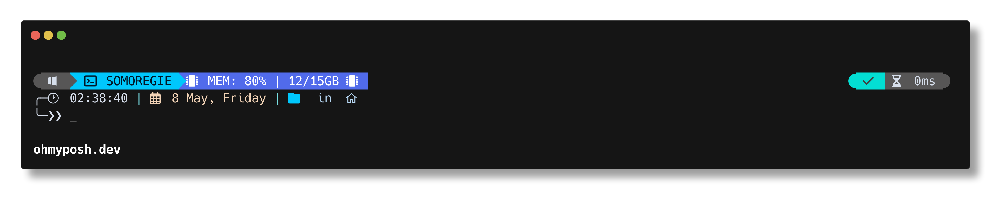
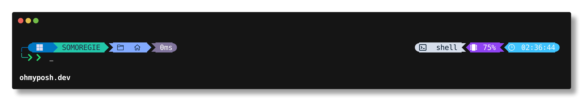

# oh-my-posh themes

> A collection of personal Oh My Posh themes with setup instructions.

Personal [Oh My Posh](https://ohmyposh.dev) prompt themes.

| Theme | File | Preview |
| --- | --- | --- |
| kushal | [`themes/kushal.omp.json`](themes/kushal.omp.json) |  |
| sunspor | [`themes/sunspor.omp.json`](themes/sunspor.omp.json) |  |

## Prerequisites

1. **Install Oh My Posh.** See the [official install guide](https://ohmyposh.dev/docs/installation/windows) for your platform. On Windows: `winget install JanDeDobbeleer.OhMyPosh -s winget`.
2. **Install a Nerd Font.** The themes use glyphs from [Nerd Fonts](https://www.nerdfonts.com/) — without one, icons render as boxes or `?`.

   ```sh
   oh-my-posh font install meslo
   ```

   `Meslo LGM NF` is the upstream recommendation. After installing, set your terminal emulator to use the font (it's a UI setting; the CLI only places the font files).

## Apply a theme

Point `oh-my-posh init` at a theme file in this repo from your shell's startup script. Replace the path with wherever you cloned this repo.

### PowerShell / pwsh

Edit `$PROFILE`:

```powershell
oh-my-posh init pwsh --config 'D:\oh-my-posh\themes\kushal.omp.json' | Invoke-Expression
```

### Bash

In `~/.bashrc` (or `~/.bash_profile` on macOS):

```bash
eval "$(oh-my-posh init bash --config ~/oh-my-posh/themes/kushal.omp.json)"
```

### Zsh

In `~/.zshrc`:

```bash
eval "$(oh-my-posh init zsh --config ~/oh-my-posh/themes/kushal.omp.json)"
```

### Fish

In `~/.config/fish/config.fish`:

```fish
oh-my-posh init fish --config ~/oh-my-posh/themes/kushal.omp.json | source
```

### Cmd (via Clink)

In `oh-my-posh.lua` inside your Clink scripts directory. Use a full path — `~` is not expanded:

```lua
load(io.popen('oh-my-posh init cmd --config C:/path/to/oh-my-posh/themes/kushal.omp.json'):read("*a"))()
```

### Nushell

In `$nu.config-path`:

```nushell
oh-my-posh init nu --config ~/oh-my-posh/themes/kushal.omp.json
```

### Elvish

In `~/.elvish/rc.elv`:

```elvish
eval (oh-my-posh init elvish --config ~/oh-my-posh/themes/kushal.omp.json)
```

### Xonsh

In `~/.xonshrc`:

```python
execx($(oh-my-posh init xonsh --config ~/oh-my-posh/themes/kushal.omp.json))
```

After editing your startup file, restart the shell (or `source` it) to load the prompt.

## Tweaking a theme

The themes target Oh My Posh schema **v3**. Each file declares it via `$schema` so editors with JSON schema support give completion and validation:

```json
"$schema": "https://raw.githubusercontent.com/JanDeDobbeleer/oh-my-posh/main/themes/schema.json"
```

A theme is a list of `blocks`; each block has `segments` (`os`, `git`, `path`, `python`, `status`, …) styled as `diamond`, `powerline`, or `plain`, with a Go-template `template` string that interpolates segment fields.

After editing, reload your shell — Oh My Posh re-reads the config on each prompt, so changes show up on the next command.

For the full segment / template / property reference, see the [Oh My Posh documentation](https://ohmyposh.dev/docs/).
